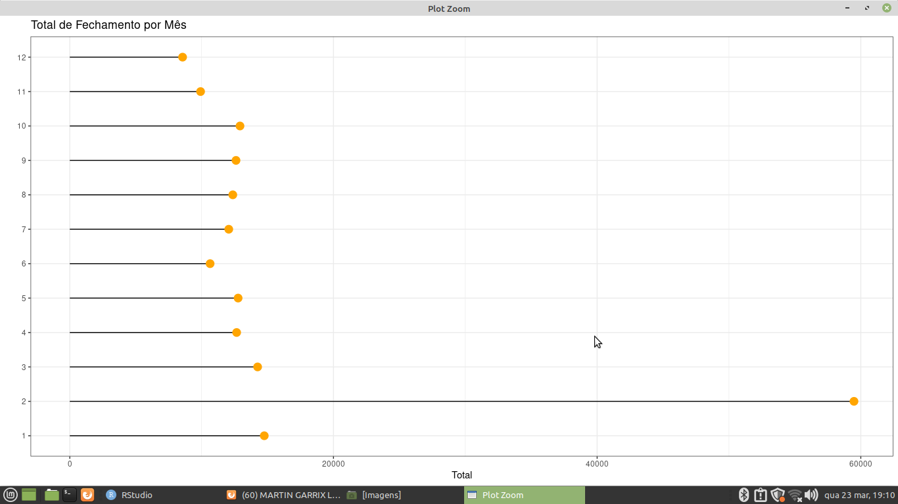

## Sobre o Projeto

** Jucepe ** 

* É o órgão administrador e executor do Registro Público de Empresas Mercantis e Atividades Afins, na circunscrição territorial sob sua jurisdição. 

* Ele forneceu um dataset de abertura, alteração e fechamento de receitas das empresas de Pernambuco, nela conteve Mês, Ano e Total das Receitas.

## Tarefas para a planilhia da Jucepe

** Aberturas de Receitas ** 

    Média de Abertura por Ano
    Total de Abertura por Ano 
   
** Alteração de Receitas ** 

    Média de Alteração por Ano
    Total de Alteração por Mês 
   
** Fechamento de Receitas ** 

    Média de Alteração por Ano
    Total de Alteração por Mês 

** Passos para a tarefa ** 

    1 - Importando o caminho do disco para a Linguagem 
    2 - Lendo o caminho do disco 
    3 - Instalando as bibliotecas para gerar gráficos e Agrupamento de dados
    4 - Lendo as Bibliotecas para gerar gráficos e Agrupamento de dados
    5 - Agrupando as colunas, para realizar calculos básicos de Soma e Média das Receitas 
    6 - Convertendo o tipo de dato do Mês e Ano para caractere 
    7 - Usando um pacote de biblioteca Esquisse para gerar gráficos dinâmicos e fazer Storytelling 
    8 - Plotando Gráficos para gerar as análises mais prévias dos dados.
    
    
## Tecnologias Utilizadas 

** O projeto foi desenvolvido com as seguintes tecnologia ** 

- [R](https://www.r-project.org/)

## Pacotes Utilizados 

** Pacotes para a sessão de agrupamentos e consultas de colunas e geração de gráficos 

- [tidyr](https://tidyr.tidyverse.org/)
- [dplyr](https://dplyr.tidyverse.org/)
- [esquisse](https://www.littlemissdata.com/fdf/esquisse)
- [ggplot2](https://ggplot2.tidyverse.org/) 

## Bibliotecas para Geração de Gráficos da Jucepe 

- [geom_bar](https://plotly.com/ggplot2/geom_bar/)
- [geom_boxplot](https://r-graph-gallery.com/boxplot.html)
- [geom_segment](https://ggplot2.tidyverse.org/reference/geom_segment.html)
- [geom_point](https://plotly.com/ggplot2/geom_point/) 

## Imagens dos Gráficos da Jucepe 

** Média de Abertura por Ano  ** 

** Total de Abertura por Ano **

** Total de Abertura por Mês ** 

** Média de Abertura por Mês ** 
 

** Total de Abertura por Mês ** 
 

** Média de Alteração de Receita por Ano **
 

** Alteração de Receita Total por Ano ** 

** Alteração de Receita Total por Mês ** 
 

** Média de Alteração por Mês ** 
 

** Total de Fechamento por Mês **
  

Desenvolvido por Gustavo Henrique de Souza Silva

